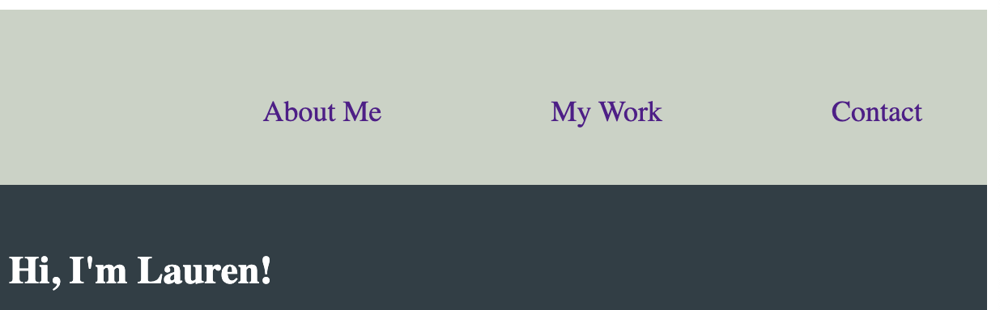

# Lauren Genzone's Portfolio

## Description 

I created this portfolio page to showcase my work, abilities, and interests as a future web developer. I'll be adding to my portfolio page as my coding knowledge expands throughout the coding bootcamp course. By the end of the course, my goal is to have designed a website that effectively communicates the essence of my work while also being aesthetically pleasing and user friendly. Future employers will be able to find all of my contact information, a brief bio, and the projects I've worked on in one convenient location. 

## Installation 

N/A

## Usage 

Use the following link to be taken to my portfolio page: //ADD DEPLOYED APP LINK 

You can easily naviagte my portfolio page by slecting which section you would like to view. All of the sections are located in the top right corner of the page (screenshot below). When you click on one of these links, you will be taken to that section of my portfolio. 
In the "My Work" section, click the project's image or description to be taken to the project's webpage. 
My "Contact" section also included clickable links. Select the desired link to be directed. 

```md

```

## Credit 

N/A

## License 

Please refer to the LICENSE in the repo. 